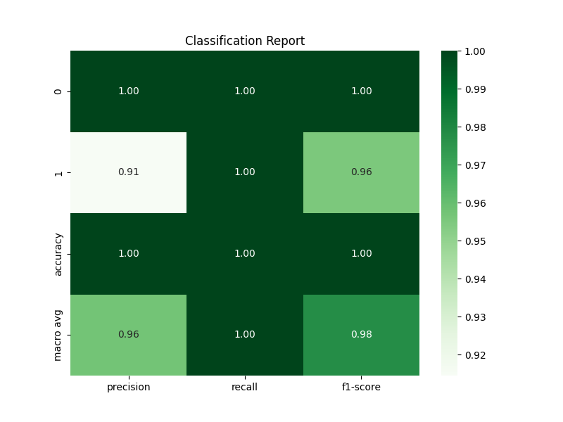

# Credit Card Fraud Detection

## Project Overview

Credit card fraud detection presents a significant challenge due to the imbalanced nature of transaction datasets,
where fraudulent transactions are much less common than legitimate ones. This project tackles this challenge head-on,
employing a combination of data preprocessing, oversampling techniques, and a carefully architected neural network to effectively identify fraudulent transactions.

## Features
- Data Preprocessing: Standardization of features and handling of imbalanced dataset through SMOTE oversampling.
- Deep Learning Model: A Sequential model comprising dense layers, utilizing ReLU activation, and a final sigmoid activation layer for binary classification.
- Performance Metrics: Evaluation based on accuracy, precision, and recall, achieving 100% fraud detection rate.
- Visualization: Learning curves and confusion matrix for model performance analysis.

## Results
The model has demonstrated exceptional performance on the credit card fraud detection task, accurately identifying all 492 instances of fraud in the dataset.

Dataset from Kaggle's Credit Card Fraud Detection challenge.
